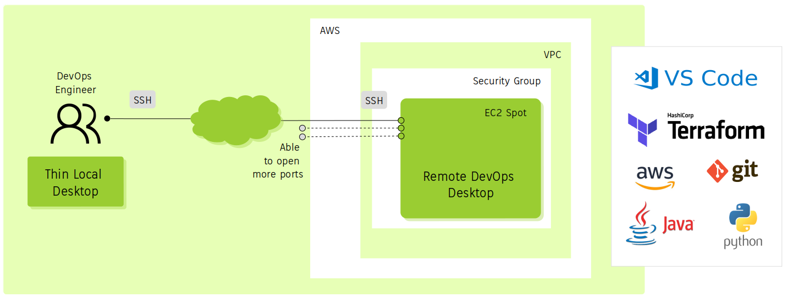

# Affordable Remote DevOps Desktop

Terraform scripts to create an affordable remote development desktop hosted in AWS Public Cloud and trying to use affordable cloud resources ( &lt; 10 euros/month ).



## Components included

### AWS EC2 Instance

Based on:

1. Ubuntu 18.04 server (`ubuntu/images/hvm-instance/ubuntu-bionic-18.04-amd64-server`)
2. [XFCE4 Desktop](https://www.xfce.org) (no install the [Xubuntu](https://xubuntu.org) Desktop packages).
3. [X2Go](https://wiki.x2go.org)
4. EC2 Spot Instance
   - m1.small (default)
   - us-east-1 (default)

| Tool           | Installed | Version 
| ---            | ---       | ---
| 1) Chromium    | Yes       | 80.0.3987.163
| 2) VS Code     | Yes       | 1.43.2 
| 3) Terraform   | Yes       | 0.12.24 
| 4) AWS CLI     | Yes       | 1.14.44  
| 5) Git         | Yes       | 2.17.1
| 6) Python      | Yes       | 3.6.9 
| 7) Java        | Yes       | ?
| 8) Docker      | Yes       | 19.03.6


## ToDo

1. Instead of using a standard Ubuntu AMI, prepare a custom AMI with pre-installed XFCE4 and X2Go (getting this EC2 instance created takes 25 minutes!), and moving all DevOps Tooling installation to other separate script.
2. Use Ansible instead of Bash script to provision the DevOps tools such as VS Code, Java, Terraform, Git, etc.
3. Backup and restoring of critical, sensitive information and custom configuration into AWS S3 or X2Go capabilities to mount remote disks over SSH.
4. Vertical Autoscaling (increase RAM, CPU or change type of instance).
5. Metrics (performance when using ADSL, WAN, 4G, etc.)

## Getting started

### Clone this repository

```sh
$ git clone https://github.com/chilcano/affordable-remote-devops
$ cd affordable-remote-devops
```

### Execute Terraform commands

```sh
$ terraform init

$ terraform plan \
  -var devenv_name="cheapdevenv" \
  -var ssh_key="remotedevenv" \
  -var developer_cidr_blocks="83.32.214.211/32" 

$ terraform apply \
  -var devenv_name="cheapdevenv" \
  -var ssh_key="remotedevenv" \
  -var developer_cidr_blocks="83.32.214.211/32" 
```

### Verifying the process

After a few minutes, connect to EC2 instance created above.

```sh
$  terraform output remotedevenv_fqdn
ec2-54-160-183-171.compute-1.amazonaws.com

$ ssh ubuntu@$(terraform output remotedevenv_fqdn) -i ~/.ssh/remotedevenv
```

#### Checking the software base

Immediately after you will get access to remote instance.

```sh
ubuntu@ip-10-0-100-4:~$ ssh -V
OpenSSH_7.6p1 Ubuntu-4ubuntu0.3, OpenSSL 1.0.2n  7 Dec 2017

ubuntu@ip-10-0-100-4:~$ ufw version
ufw 0.36
Copyright 2008-2015 Canonical Ltd.

ubuntu@ip-10-0-100-4:~$ sudo ufw status
Status: inactive

ubuntu@ip-10-0-100-4:~$ apt list -a xfce4
Listing... Done
xfce4/bionic,now 4.12.4 all [installed]

ubuntu@ip-10-0-100-4:~$ x2goversion 
: 4.1.0.3
: 4.1.0.3
: 4.1.0.3
: 4.1.0.3
: 4.1.0.3
: 3.5.99.22
: 4.1.0.3
```
#### Checking the DevOps tooling installed

Tooling installed. You probably get different versions.

```sh
ubuntu@ip-10-0-100-4:~$ chromium-browser --version
Chromium 80.0.3987.163 Built on Ubuntu , running on Ubuntu 18.04

buntu@ip-10-0-100-4:~$ git --version
git version 2.17.1

ubuntu@ip-10-0-100-4:~$ code --version
1.43.2
0ba0ca52957102ca3527cf479571617f0de6ed50
x64

ubuntu@ip-10-0-100-4:~$ python3 --version
Python 3.6.9

ubuntu@ip-10-0-100-4:~$ aws --version
aws-cli/1.14.44 Python/3.6.9 Linux/4.15.0-1063-aws botocore/1.8.48

ubuntu@ip-10-0-100-4:~$ terraform -v
Terraform v0.12.24

ubuntu@ip-10-0-100-4:~$ docker --version
Docker version 19.03.6, build 369ce74a3c

ubuntu@ip-10-0-100-4:~$ java --version
openjdk 11.0.6 2020-01-14
OpenJDK Runtime Environment (build 11.0.6+10-post-Ubuntu-1ubuntu118.04.1)
OpenJDK 64-Bit Server VM (build 11.0.6+10-post-Ubuntu-1ubuntu118.04.1, mixed mode, sharing)
```

### Connect to the remote DevOps Desktop

We are going to use X2Go Client in a local Ubuntu PC.

#### Installing X2Go Client

If you are using Ubuntu, install X2Go Client is easy, just follow this commands.
```sh
sudo add-apt-repository ppa:x2go/stable
sudo apt-get update
sudo apt-get install -y x2goclient
```

If you are using Windows, OSX, Raspbian, Java, iOS (iPad) or Android, you have clients too:
- [X2Go Client for Windows](https://code.x2go.org/releases/binary-win32/x2goclient/releases/)
- [X2Go Client for Mac OSX](https://code.x2go.org/releases/)

#### Configure X2Go Client

Below some screenshots if you want to know how looks like in Ubuntu 19.10.
Before lets get the FQDN of EC2 instance.  

```sh
chilcano@inti:~/git-repos/affordable-remote-devenv$ terraform output remotedevenv_fqdn
ec2-100-26-48-80.compute-1.amazonaws.com
```
Before all, You have to wait ~20 minutes (yes, It is too much and I'm going to fix it - see ToDo) after `terraform apply`. Then, open X2Go Client and enter these details about your EC2 Instance.


And finally here below the Remote DevOps Desktop.


## Troubleshooting

### Check the creation of AWS Resources

Check the creation of EC2 instance and debug the `remotedevenc.sh` bash script.

```sh
buntu@ip-10-0-100-4:~$ cat /var/log/cloud-init-output.log

Cloud-init v. 19.4-33-gbb4131a2-0ubuntu1~18.04.1 running 'init-local' at Wed, 08 Apr 2020 17:16:17 +0000. Up 25.77 seconds.
Cloud-init v. 19.4-33-gbb4131a2-0ubuntu1~18.04.1 running 'init' at Wed, 08 Apr 2020 17:16:24 +0000. Up 32.94 seconds.
...
aws --region $REGION ec2 create-tags --resources $INSTANCE_ID --tags "Key=Name,Value=cheapdevenv" "Key=Environment,Value=cheapdevenv"

An error occurred (UnauthorizedOperation) when calling the CreateTags operation: You are not authorized to perform this operation. Encoded authorization failure message: ....
Cloud-init v. 19.4-33-gbb4131a2-0ubuntu1~18.04.1 running 'modules:final' at Wed, 08 Apr 2020 17:17:34 +0000. Up 102.63 seconds.
2020-04-08 17:22:20,714 - util.py[WARNING]: Failed running /var/lib/cloud/instance/scripts/part-001 [255]
2020-04-08 17:22:20,750 - cc_scripts_user.py[WARNING]: Failed to run module scripts-user (scripts in /var/lib/cloud/instance/scripts)
2020-04-08 17:22:20,751 - util.py[WARNING]: Running module scripts-user (<module 'cloudinit.config.cc_scripts_user' from '/usr/lib/python3/dist-packages/cloudinit/config/cc_scripts_user.py'>) failed
Cloud-init v. 19.4-33-gbb4131a2-0ubuntu1~18.04.1 finished at Wed, 08 Apr 2020 17:22:21 +0000. Datasource DataSourceEc2Local.  Up 389.30 seconds
```

The above error means that setting tags to AWS EC2 instance don't have enough permissions. This is solved attaching `ec2_ebs_policy` to `ec2_iam_role`.


### Error: `bash: x2golistsessions: command not found`

```sh
chilcano@inti:~$ x2goclient --debug
....
x2go-DEBUG-../src/sshprocess.cpp:538> Have stderr only, something must be wrong.
x2go-DEBUG-../src/sshprocess.cpp:543> SSH finished: false - "bash: x2golistsessions: command not found " (0).
x2go-DEBUG-../src/onmainwindow.cpp:3861> "bash: x2golistsessions: command not found "
x2go-DEBUG-../src/onmainwindow.cpp:1527> Close event received.
...
```

The X2Go Server has not been installed properly. Once installed you can verify it in this way:   
```sh
ubuntu@ip-10-0-100-4:~$ x2goversion 
x2goserver: 4.1.0.0
x2goserver-common: 4.1.0.0
x2goserver-extensions: 4.1.0.0
x2goserver-fmbindings: 4.1.0.0
x2goserver-printing: 4.1.0.0
x2goserver-x2goagent: 3.5.99.16
x2goserver-xsession: 4.1.0.0
```

### Error: `Unable to locate package xubuntu-restricted-extra`

```sh
E: Unable to locate package xubuntu-restricted-extra
```

XFCE4 has not been installed and Xubuntu (optional) core with all goodies.
```sh
apt-get install -y xfce4
apt-get install -y xubuntu-core xubuntu-restricted-addons xubuntu-restricted-extra
```

### Installing and configuring UFW

```sh
ubuntu@ip-10-0-100-4:~$ sudo ufw default deny incoming
ubuntu@ip-10-0-100-4:~$ sudo ufw allow OpenSSH
ubuntu@ip-10-0-100-4:~$ sudo ufw enable
ubuntu@ip-10-0-100-4:~$ sudo ufw status
Status: active
Logging: on (low)
Default: deny (incoming), allow (outgoing), disabled (routed)
New profiles: skip

To                         Action      From
--                         ------      ----
22/tcp (OpenSSH)           ALLOW IN    Anywhere
22/tcp (OpenSSH (v6))      ALLOW IN    Anywhere (v6)
```

## References

1. https://itsfoss.com/install-xfce-desktop-xubuntu
2. https://cepa.io/2018/08/05/building-an-ultimate-remote-linux-workstation
3. https://writing.frankmcpherson.net/computers/2018/11/09/virtual-desktop.html