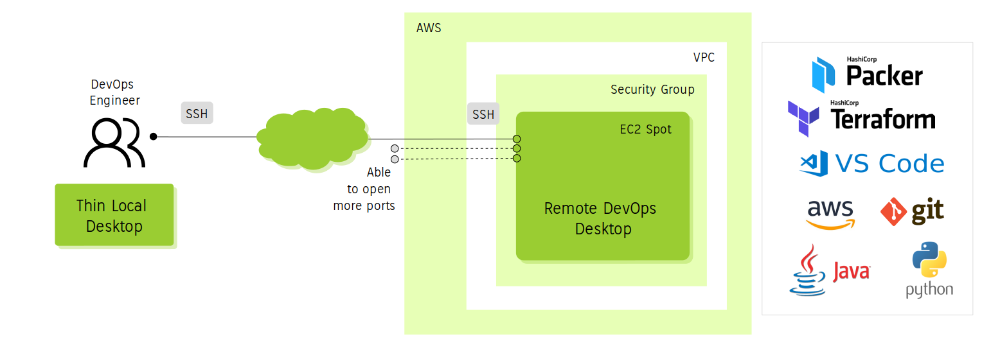
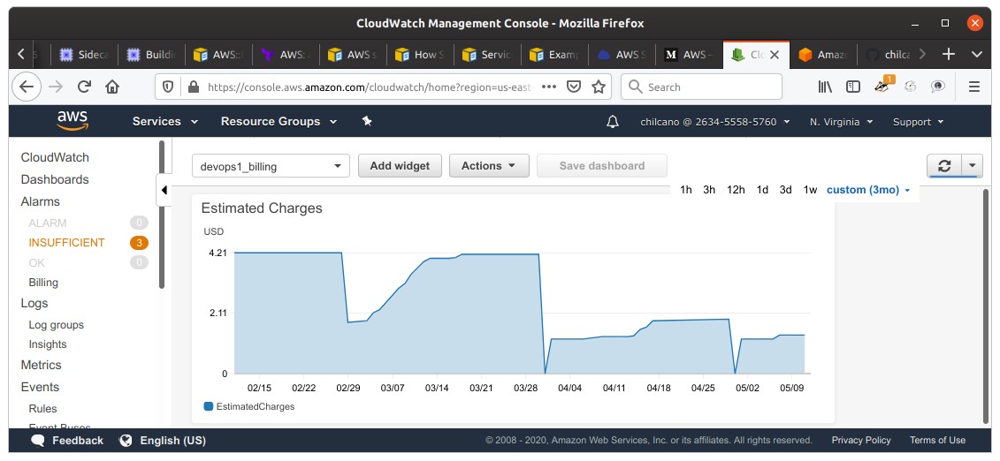
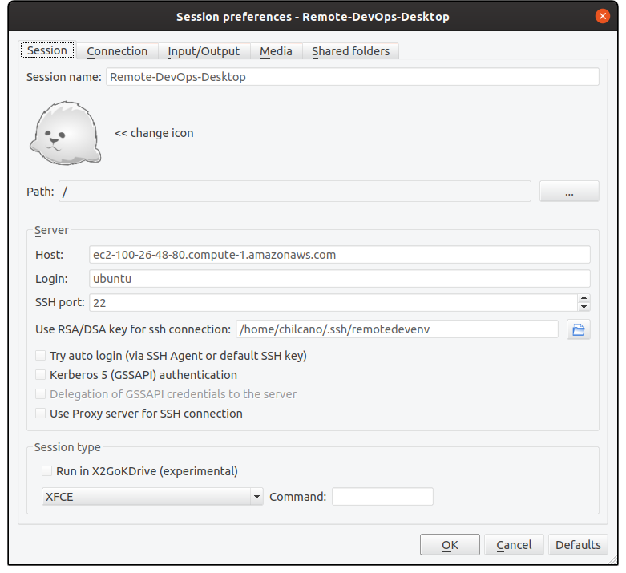
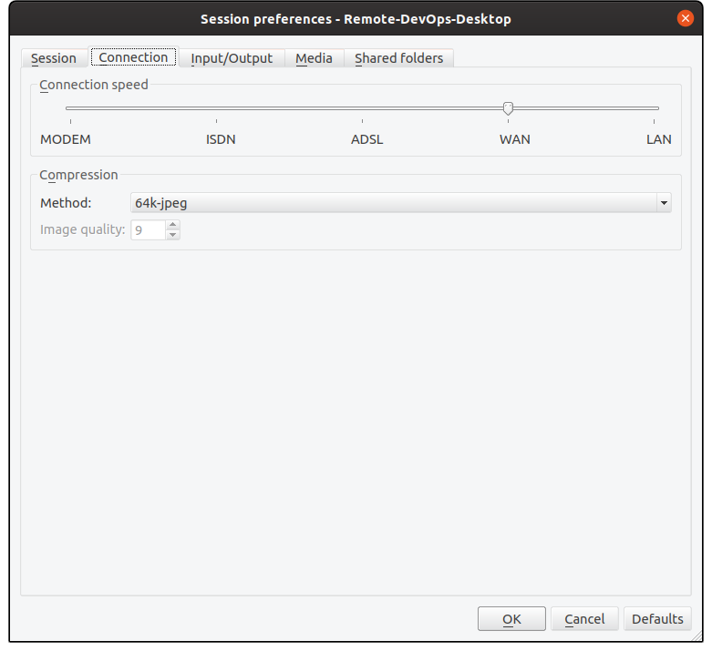
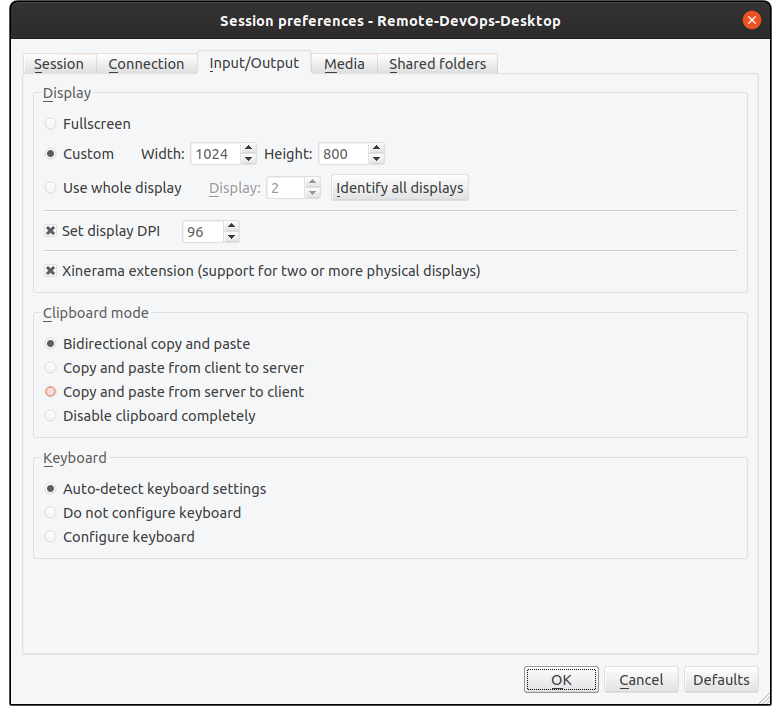
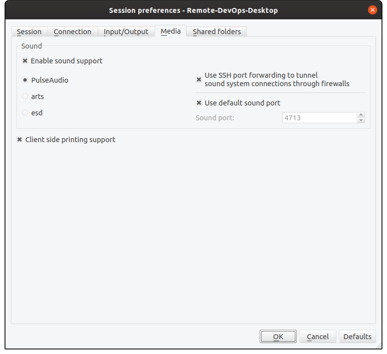
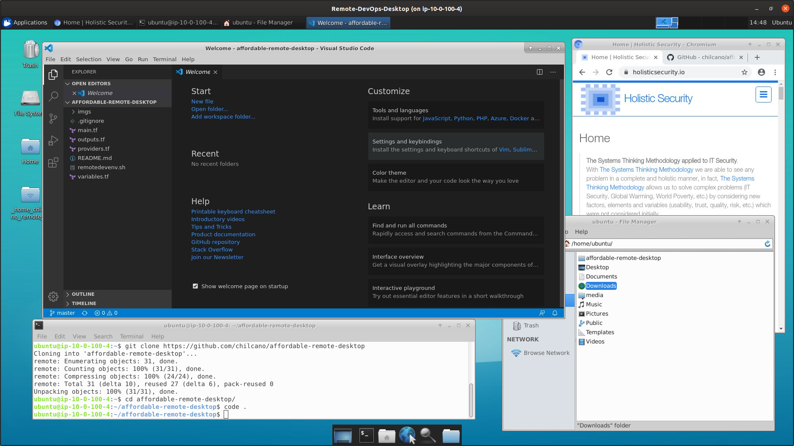

- [Affordable Remote DevOps Desktop](#affordable-remote-devops-desktop)
  - [AWS services used](#aws-services-used)
  - [Software pre-installed](#software-pre-installed)
  - [Getting started](#getting-started)
    - [Clone this repository](#clone-this-repository)
    - [Execute Terraform plan using customized AMI](#execute-terraform-plan-using-customized-ami)
      - [Instance based on Ubuntu 18.04](#instance-based-on-ubuntu-1804)
      - [Changing the EC2 Instance Type](#changing-the-ec2-instance-type)
      - [Using new custom AMI Ubuntu Focal 20.04 with `XFCE4` and `X2Go Server`](#using-new-custom-ami-ubuntu-focal-2004-with-xfce4-and-x2go-server)
    - [Execute Terraform plan providing a customized AMI (using Packer.io)](#execute-terraform-plan-providing-a-customized-ami-using-packerio)
    - [Verifying the process](#verifying-the-process)
      - [Checking configurations and versions installed](#checking-configurations-and-versions-installed)
    - [Connect to the remote DevOps Desktop](#connect-to-the-remote-devops-desktop)
      - [Installing X2Go Client](#installing-x2go-client)
      - [Configure X2Go Client](#configure-x2go-client)
  - [Troubleshooting](#troubleshooting)
    - [Check the creation of AWS Resources](#check-the-creation-of-aws-resources)
    - [Error: `bash: x2golistsessions: command not found`](#error-bash-x2golistsessions-command-not-found)
    - [Error: `Unable to locate package xubuntu-restricted-extra`](#error-unable-to-locate-package-xubuntu-restricted-extra)
    - [Installing and configuring UFW](#installing-and-configuring-ufw)
  - [Performance](#performance)
  - [References](#references)

# Affordable Remote DevOps Desktop

Terraform scripts to create an affordable remote development desktop hosted in AWS Public Cloud and trying to use affordable cloud resources ( &lt; 10 euros/month ).



## AWS services used

The AWS services used are:

1. EC2 Instance
   - Spot
   - m1.small (by default)
   - us-east-1 (by default)
2. AWS CloudWatch (free tier)
   - 2 Dashboard
   - 4 Metrics
   - 2 Alerts

 

## Software pre-installed

I'm using Ubuntu server and on It I'm going to install/installed 3 type of software:

1. Ubuntu server with GUI enabled created from a custom AMI:
   * Ubuntu server AMI:
      - AMI Name `chilcano/images/hvm-instance/ubuntu-bionic-18.04-amd64-gui` and AMI Owner `Chilcano` (by default)
   * [XFCE4 Desktop](https://www.xfce.org) (no install the [Xubuntu](https://xubuntu.org) Desktop packages).
   * [X2Go](https://wiki.x2go.org)
2. Initial utilities:
   * git, awscli, jq, curl, etc.
   * Docker
   * Chromium
3. DevOps tools (manual installation):  
   The installation of this will be through a bash script installer. During the Terraform execution, the `install_devops_tpl.sh` will download the [`setting_devops_tools.sh`](https://github.com/chilcano/how-tos/blob/master/resources/setting_devops_tools.sh) in the remote instance for you can execute it when you want it. The `setting_devops_tools.sh` script can install the next tools:
   - **VS Code**, multiples extensions and an initial configuration
   - **Terraform** (version 1.15-oci by default)
   - **Packer**
   - **AWS CLI**
   - **Python**
   - **Java** (8 and 11 versions)
   - **Maven**
   - **Ansible**

## Getting started

### Clone this repository
```sh
$ git clone https://github.com/chilcano/affordable-remote-desktop
$ cd affordable-remote-desktop
```

### Execute Terraform plan using customized AMI

#### Instance based on Ubuntu 18.04
The default process creates an EC2 instance based on `m1.small` and uses the customized public AMI (Name `chilcano/images/hvm-instance/ubuntu-bionic-18.04-amd64-gui` and owner "263455585760", and based on Ubuntu 18.04 server). This customized AMI has `XFCE4` and `X2Go Server` pre-installed and It has been created using Hashicorp Packer ([here I share the Packer scripts](resources/packer/)).

```sh
$ terraform apply \
  -var node_name="devops0" \
  -var ssh_key="chilcan0" \
  -var developer_cidr_blocks="83.45.103.161/32" 
```

#### Changing the EC2 Instance Type
If you are going to use an EC2 Instance Type different such as `t2.small` or `t2.medium`, you have to consider increasing the bid for the EC2 Spot instance. These are the combinations that have worked:
```sh
$ terraform apply \ 
  -var node_name="devops0" \
  -var ssh_key="chilcan0" \
  -var developer_cidr_blocks="83.45.103.161/32" \
  -var remotedesktop_instance_type="t2.small"
```

The `remotedesktop_spot_price` by default is `0.01` and that has worked for `m1.small` and `t2.small`, however if you are going to use `t2.medium`, you should try to increase `remotedesktop_spot_price`. The minimum has worked for me is `0.014`.
```sh
$ terraform apply \
  -var node_name="devops0" \
  -var ssh_key="chilcan0" \
  -var developer_cidr_blocks="83.45.103.161/32" \
  -var remotedesktop_instance_type="t2.medium" \
  -var remotedesktop_spot_price="0.014"
```

#### Using new custom AMI Ubuntu Focal 20.04 with `XFCE4` and `X2Go Server` 
I've made public another custom AMI based on Ubuntu Focal 20.04, then let's go using it:
```sh
$ terraform apply \
  -var node_name="devops0" \
  -var ssh_key="chilcan0" \
  -var developer_cidr_blocks="83.45.103.161/32" \
  -var remotedesktop_instance_type="t2.medium" \
  -var ami_name_filter="chilcano/images/hvm-ssd/ubuntu-focal-20.04-amd64-gui-*" \
  -var remotedesktop_spot_price="0.014"
```

### Execute Terraform plan providing a customized AMI (using Packer.io)
The Terraform plan Iǘe shared here detects if the base AMI used to build the EC2 Instance has `XFCE4` and `X2Go Server` pre-installed, if so Terraform will install both packages taking ~20 minutes or more.  
For example, next Terraform plan execution will install both packages because the `ubuntu/images/hvm-ssd/ubuntu-bionic-18.04-amd64-server` AMI owned by `099720109477` (Ubuntu) doesn't include any `XFCE` installed.
```sh
$ terraform apply \
  -var node_name="devops0" \
  -var ssh_key="chilcan0" \
  -var developer_cidr_blocks="83.45.103.161/32" \
  -var ami_name_filter="ubuntu/images/hvm-ssd/ubuntu-bionic-18.04-amd64-server-*" \
  -var ami_owner="099720109477" 
```

Finally, if you don't have any customized AMI with `XFCE4` and `X2Go Server` pre-installed, and you want one but `private`, then you are lucky because I've shared Packer scripts to cook your own. Then, the steps you have to follow are:   
1. Create your own private and customized AMI using Packer. 
   [Follow the steps here to run the Packer scripts and get your own AMI](resources/packer/).
2. Provision your Remote DevOps Desktop on AWS using Terraform.
   ```sh
   $ terraform apply \
     -var node_name="devops0" \
     -var ssh_key="chilcan0" \
     -var developer_cidr_blocks="83.45.103.161/32" \
     -var ami_name_filter="your-ami-name-filter" \
     -var ami_owner="your-ami-owner" 
   ```

### Verifying the process
After a few minutes, connect to EC2 instance created above.  
```sh
$  terraform output remotedesktop_fqdn
ec2-54-160-183-171.compute-1.amazonaws.com

$ ssh ubuntu@$(terraform output remotedesktop_fqdn) -i ~/.ssh/remotedevenv

// Checking Cloud-Init 
ubuntu@ip-10-0-100-4:~$ tail -f /var/log/cloud-init-output.log

// Checking the bash scripts created by Cloud-Init
ubuntu@ip-10-0-100-4:~$ ls -la /var/lib/cloud/instance/scripts/
total 16
drwxr-xr-x 2 root root 4096 Apr 15 18:28 .
drwxr-xr-x 5 root root 4096 Apr 15 18:35 ..
-rwx------ 1 root root 2651 Apr 15 18:28 install_devops.sh
-rwx------ 1 root root 1149 Apr 15 18:28 install_gui.sh
```

The `install_devops.sh` and `install_gui.sh` were created by Terraform during provisioning, both bash scripts install and configure the DevOps tools and GUI tools respectively.


#### Checking configurations and versions installed
Immediately after you will get access to remote instance. 
```sh
$ lsb_release -a

// Default Display Manager
$ cat /etc/X11/default-display-manager

$ ssh -V

$ apt list -a xfce4

$ x2goversion 

$ git --version

$ code --version

$ python3 --version

$ aws --version

$ terraform -v

$ docker --version

$ java --version

$ chromium-browser --version
```

### Connect to the remote DevOps Desktop
We are going to use X2Go Client in a local Ubuntu PC.

#### Installing X2Go Client
If you are using Ubuntu, install X2Go Client is easy, just follow this commands.
```sh
$ sudo add-apt-repository ppa:x2go/stable
$ sudo apt-get update
$ sudo apt-get install -y x2goclient
```

If you are using Windows, OSX, Raspbian, Java, iOS (iPad) or Android, you have clients too:
- [X2Go Client for Windows](https://code.x2go.org/releases/binary-win32/x2goclient/releases/)
- [X2Go Client for Mac OSX](https://code.x2go.org/releases/)

#### Configure X2Go Client
Below some screenshots if you want to know how looks like in Ubuntu 19.10.
Before lets get the FQDN of EC2 instance.  

```sh
chilcano@inti:~/git-repos/affordable-remote-desktop$ terraform output remotedesktop_fqdn
ec2-100-26-48-80.compute-1.amazonaws.com
```
Before all, You have to wait ~5 minutes (yes, It is too much and I'm going to fix it - see ToDo) after `terraform apply`. Then, open X2Go Client and enter the details about your EC2 Instance.

 
 

Also, you can run X2Go Client from terminal.
```sh
$ x2goclient --session=RemoteDevOps --hide --add-to-known-hosts
```

And finally here below the Remote DevOps Desktop.  

 

## Troubleshooting
### Check the creation of AWS Resources
Check the creation of EC2 instance and debug the bash scripts.

```sh
// Checking Cloud-Init 
ubuntu@ip-10-0-100-4:~$ cat /var/log/cloud-init-output.log

// Checking the bash scripts created by Cloud-Init
ubuntu@ip-10-0-100-4:~$ ls -la /var/lib/cloud/instance/scripts/
total 16
drwxr-xr-x 2 root root 4096 Apr 15 18:28 .
drwxr-xr-x 5 root root 4096 Apr 15 18:35 ..
-rwx------ 1 root root 2651 Apr 15 18:28 install_devops.sh
-rwx------ 1 root root 1149 Apr 15 18:28 install_gui.sh
```

### Error: `bash: x2golistsessions: command not found`
```sh
chilcano@inti:~$ x2goclient --debug
....
x2go-DEBUG-../src/sshprocess.cpp:538> Have stderr only, something must be wrong.
x2go-DEBUG-../src/sshprocess.cpp:543> SSH finished: false - "bash: x2golistsessions: command not found " (0).
x2go-DEBUG-../src/onmainwindow.cpp:3861> "bash: x2golistsessions: command not found "
x2go-DEBUG-../src/onmainwindow.cpp:1527> Close event received.
...
```

The X2Go Server has not been installed properly. Once installed you can verify it in this way:   
```sh
ubuntu@ip-10-0-100-4:~$ x2goversion 
x2goserver: 4.1.0.0
x2goserver-common: 4.1.0.0
x2goserver-extensions: 4.1.0.0
x2goserver-fmbindings: 4.1.0.0
x2goserver-printing: 4.1.0.0
x2goserver-x2goagent: 3.5.99.16
x2goserver-xsession: 4.1.0.0
```

### Error: `Unable to locate package xubuntu-restricted-extra`
```sh
E: Unable to locate package xubuntu-restricted-extra
```

XFCE4 has not been installed and Xubuntu (optional) core with all goodies.
```sh
apt-get install -y xfce4
apt-get install -y xubuntu-core xubuntu-restricted-addons xubuntu-restricted-extra
```

### Installing and configuring UFW
```sh
ubuntu@ip-10-0-100-4:~$ sudo ufw default deny incoming
ubuntu@ip-10-0-100-4:~$ sudo ufw allow OpenSSH
ubuntu@ip-10-0-100-4:~$ sudo ufw enable
ubuntu@ip-10-0-100-4:~$ sudo ufw status
Status: active
Logging: on (low)
Default: deny (incoming), allow (outgoing), disabled (routed)
New profiles: skip

To                         Action      From
--                         ------      ----
22/tcp (OpenSSH)           ALLOW IN    Anywhere
22/tcp (OpenSSH (v6))      ALLOW IN    Anywhere (v6)
```

## Performance
| Type Instance | Price       | vCPU | Mem    | Storage  | Network      | Perforamce
| ---           | ---         | ---  | ---    | ---      | ---          | ---
| m1.small      | ~0.0040 USD | 1    | 1.7 GB | 160 GB   | Low          | **2/10**
| t2.small      | ~0.0230 USD | 1    | 2.0 GB | EBS only | Low-Moderate | **3/10**
| t2.medium     | ~0.0464 USD | 2    | 4.0 GB | EBS only | Low-Moderate | **5/10**

## References
1. https://itsfoss.com/install-xfce-desktop-xubuntu
2. https://cepa.io/2018/08/05/building-an-ultimate-remote-linux-workstation
3. https://writing.frankmcpherson.net/computers/2018/11/09/virtual-desktop.html