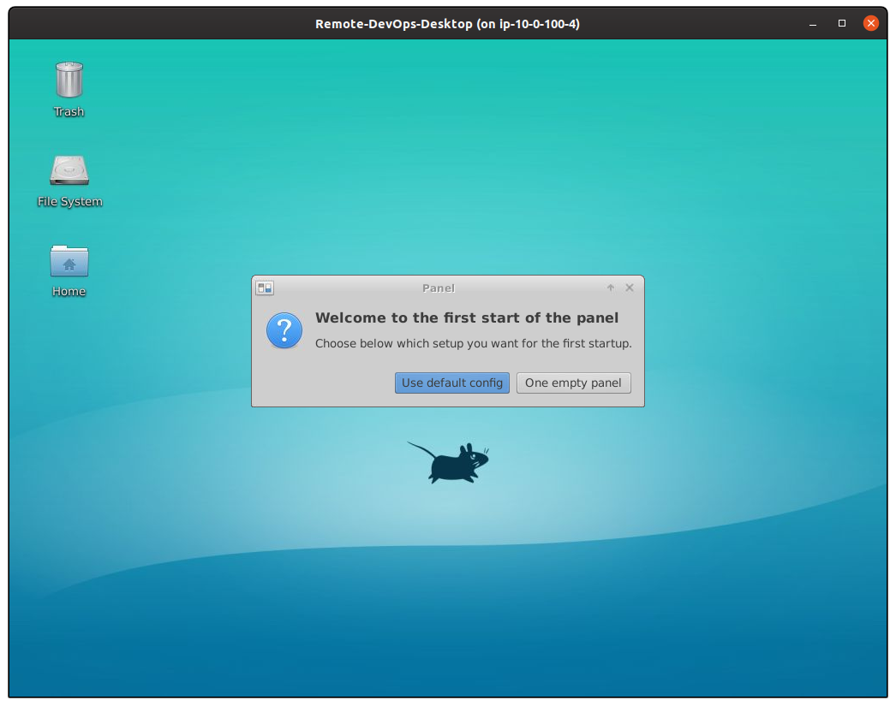

# Affordable Remote DevOps Desktop

Terraform scripts to create an affordable remote development desktop hosted in AWS Public Cloud and trying to use affordable cloud resources ( &lt; 10 euros/month ).


## Components included

### AWS EC2 Instance

Based on:

1. Ubuntu server AMI:
   - AMI Name `chilcano/images/hvm-instance/ubuntu-bionic-18.04-amd64-gui` and AMI Owner `Chilcano` (by default)
2. [XFCE4 Desktop](https://www.xfce.org) (no install the [Xubuntu](https://xubuntu.org) Desktop packages).
3. [X2Go](https://wiki.x2go.org)
4. EC2 Instance
   - Spot
   - m1.small (default)
   - us-east-1 (default)

| Tool           | Installed | Version 
| ---            | ---       | ---
| 1) Chromium    | Yes       | 80.0.3987.163
| 2) VS Code     | Yes       | 1.43.2 
| 3) Terraform   | Yes       | 0.12.24 
| 4) AWS CLI     | Yes       | 1.14.44  
| 5) Git         | Yes       | 2.17.1
| 6) Python      | Yes       | 3.6.9 
| 7) Java        | Yes       | OpenJDK 11.0.6
| 8) Docker      | Yes       | 19.03.6


## ToDo

See [GitHub issues tab](https://github.com/chilcano/affordable-remote-desktop/issues).

## Getting started

### Clone this repository

```sh
$ git clone https://github.com/chilcano/affordable-remote-desktop
$ cd affordable-remote-desktop
```

### Execute Terraform plan using customized AMI (by default)

By default, if you want a Remote DevOps Desktop on AWS in ~3 minutes, you should just run the next commands. This process uses my customized public AMI (Name `chilcano/images/hvm-instance/ubuntu-bionic-18.04-amd64-gui` and Owner `Chilcano`). This customized AMI with `XFCE4` and `X2Go Server` pre-installed has been created using Hashicorp Packer ([here I share the Packer scripts](resources/packer/)).

```sh
$ terraform init

$ terraform plan \
  -var node_name="devops1" \
  -var ssh_key="remotedesktop" \
  -var developer_cidr_blocks="83.32.214.211/32" 

$ terraform apply \
  -var node_name="devops1" \
  -var ssh_key="remotedesktop" \
  -var developer_cidr_blocks="83.32.214.211/32" 
```

### Execute Terraform plan providing a customized AMI (using Packer.io)

The Terraform plan I share here detects if the base AMI used to build the EC2 Instance has `XFCE4` and `X2Go Server` pre-installed, if so Terraform will install both packages taking ~20 minutes more. For example, next Terraform plan execution will install both packages because the `ubuntu/images/hvm-ssd/ubuntu-bionic-18.04-amd64-server` AMI owned by `099720109477` (Ubuntu) doesn't include any GUI Desktop Environment installed.

```sh
$ terraform init

$ terraform plan \
  -var node_name="devops2" \
  -var ssh_key="remotedesktop" \
  -var developer_cidr_blocks="83.32.214.211/32" \
  -var ami_name_filter="ubuntu/images/hvm-ssd/ubuntu-bionic-18.04-amd64-server-*"\
  -var ami_owner="099720109477" 

$ terraform apply \
  -var node_name="devops2" \
  -var ssh_key="remotedesktop" \
  -var developer_cidr_blocks="83.32.214.211/32" \
  -var ami_name_filter="ubuntu/images/hvm-ssd/ubuntu-bionic-18.04-amd64-server-*"\
  -var ami_owner="099720109477" 
```

Finally, if you don't have any customized AMI with `XFCE4` and `X2Go Server` pre-installed, and you want one but `private`, then you are lucky because I've shared Packer scripts to cook your own. Then the steps are:

1. Create your own private and customized AMI using Packer. You can [review the Packer scripts here](resources/packer/).
   ```sh
   $ cd affordable-remote-desktop/resources/packer
   $ export AWS_ACCESS_KEY_ID="your-access-key-id"; export AWS_SECRET_ACCESS_KEY="your-secret-access-key"
   $ export AWS_VPC_ID="your-vpc-id-07c2fc78af4aca574"; export AWS_SUBNET_ID="your-subnet-id-00096b5a3329dd4b2" 
   $ packer validate ubuntu_gui.json
   $ packer build ubuntu_gui.json
   ```
2. Provision your Remote DevOps Desktop on AWS using Terraform.
   ```sh
   $ terraform init
   
   $ terraform plan \
     -var node_name="devops2" \
     -var ssh_key="remotedesktop" \
     -var developer_cidr_blocks="83.32.214.211/32" \
     -var ami_name_filter="your-ami-name-filter"\
     -var ami_owner="your-ami-owner" 
   
   $ terraform apply \
     -var node_name="devops2" \
     -var ssh_key="remotedesktop" \
     -var developer_cidr_blocks="83.32.214.211/32" \
     -var ami_name_filter="your-ami-name-filter"\
     -var ami_owner="your-ami-owner" 
   ```

### Verifying the process

After a few minutes, connect to EC2 instance created above.

```sh
$  terraform output remotedesktop_fqdn
ec2-54-160-183-171.compute-1.amazonaws.com

$ ssh ubuntu@$(terraform output remotedesktop_fqdn) -i ~/.ssh/remotedevenv

// Checking Cloud-Init 
ubuntu@ip-10-0-100-4:~$ tail -f /var/log/cloud-init-output.log

// Checking the bash scripts created by Cloud-Init
ubuntu@ip-10-0-100-4:~$ ls -la /var/lib/cloud/instance/scripts/
total 16
drwxr-xr-x 2 root root 4096 Apr 15 18:28 .
drwxr-xr-x 5 root root 4096 Apr 15 18:35 ..
-rwx------ 1 root root 2651 Apr 15 18:28 install_devops.sh
-rwx------ 1 root root 1149 Apr 15 18:28 install_gui.sh
```

The `install_devops.sh` and `install_gui.sh` were created by Terraform during provisioning, both bash scripts install and configure the DevOps tools and GUI tools respectively.


__Checking the GUI tools installed__

Immediately after you will get access to remote instance.

```sh
ubuntu@ip-10-0-100-4:~$ ssh -V
OpenSSH_7.6p1 Ubuntu-4ubuntu0.3, OpenSSL 1.0.2n  7 Dec 2017

ubuntu@ip-10-0-100-4:~$ ufw version
ufw 0.36
Copyright 2008-2015 Canonical Ltd.

ubuntu@ip-10-0-100-4:~$ sudo ufw status
Status: inactive

ubuntu@ip-10-0-100-4:~$ apt list -a xfce4
Listing... Done
xfce4/bionic,now 4.12.4 all [installed]

ubuntu@ip-10-0-100-4:~$ x2goversion 
: 4.1.0.3
: 4.1.0.3
: 4.1.0.3
: 4.1.0.3
: 4.1.0.3
: 3.5.99.22
: 4.1.0.3
```

__Checking the DevOps tools installed__

You probably get different versions.

```sh
ubuntu@ip-10-0-100-4:~$ chromium-browser --version
Chromium 80.0.3987.163 Built on Ubuntu , running on Ubuntu 18.04

buntu@ip-10-0-100-4:~$ git --version
git version 2.17.1

ubuntu@ip-10-0-100-4:~$ code --version
1.43.2
0ba0ca52957102ca3527cf479571617f0de6ed50
x64

ubuntu@ip-10-0-100-4:~$ python3 --version
Python 3.6.9

ubuntu@ip-10-0-100-4:~$ aws --version
aws-cli/1.14.44 Python/3.6.9 Linux/4.15.0-1063-aws botocore/1.8.48

ubuntu@ip-10-0-100-4:~$ terraform -v
Terraform v0.12.24

ubuntu@ip-10-0-100-4:~$ docker --version
Docker version 19.03.6, build 369ce74a3c

ubuntu@ip-10-0-100-4:~$ java --version
openjdk 11.0.6 2020-01-14
OpenJDK Runtime Environment (build 11.0.6+10-post-Ubuntu-1ubuntu118.04.1)
OpenJDK 64-Bit Server VM (build 11.0.6+10-post-Ubuntu-1ubuntu118.04.1, mixed mode, sharing)
```

### Connect to the remote DevOps Desktop

We are going to use X2Go Client in a local Ubuntu PC.

#### Installing X2Go Client

If you are using Ubuntu, install X2Go Client is easy, just follow this commands.
```sh
sudo add-apt-repository ppa:x2go/stable
sudo apt-get update
sudo apt-get install -y x2goclient
```

If you are using Windows, OSX, Raspbian, Java, iOS (iPad) or Android, you have clients too:
- [X2Go Client for Windows](https://code.x2go.org/releases/binary-win32/x2goclient/releases/)
- [X2Go Client for Mac OSX](https://code.x2go.org/releases/)

#### Configure X2Go Client

Below some screenshots if you want to know how looks like in Ubuntu 19.10.
Before lets get the FQDN of EC2 instance.  

```sh
chilcano@inti:~/git-repos/affordable-remote-destop$ terraform output remotedesktop_fqdn
ec2-100-26-48-80.compute-1.amazonaws.com
```
Before all, You have to wait ~20 minutes (yes, It is too much and I'm going to fix it - see ToDo) after `terraform apply`. Then, open X2Go Client and enter these details about your EC2 Instance.


And finally here below the Remote DevOps Desktop.  




## Troubleshooting

### Check the creation of AWS Resources

Check the creation of EC2 instance and debug the bash scripts.

```sh
// Checking Cloud-Init 
ubuntu@ip-10-0-100-4:~$ tail -f /var/log/cloud-init-output.log

// Checking the bash scripts created by Cloud-Init
ubuntu@ip-10-0-100-4:~$ ls -la /var/lib/cloud/instance/scripts/
total 16
drwxr-xr-x 2 root root 4096 Apr 15 18:28 .
drwxr-xr-x 5 root root 4096 Apr 15 18:35 ..
-rwx------ 1 root root 2651 Apr 15 18:28 install_devops.sh
-rwx------ 1 root root 1149 Apr 15 18:28 install_gui.sh
```

### Error: `bash: x2golistsessions: command not found`

```sh
chilcano@inti:~$ x2goclient --debug
....
x2go-DEBUG-../src/sshprocess.cpp:538> Have stderr only, something must be wrong.
x2go-DEBUG-../src/sshprocess.cpp:543> SSH finished: false - "bash: x2golistsessions: command not found " (0).
x2go-DEBUG-../src/onmainwindow.cpp:3861> "bash: x2golistsessions: command not found "
x2go-DEBUG-../src/onmainwindow.cpp:1527> Close event received.
...
```

The X2Go Server has not been installed properly. Once installed you can verify it in this way:   
```sh
ubuntu@ip-10-0-100-4:~$ x2goversion 
x2goserver: 4.1.0.0
x2goserver-common: 4.1.0.0
x2goserver-extensions: 4.1.0.0
x2goserver-fmbindings: 4.1.0.0
x2goserver-printing: 4.1.0.0
x2goserver-x2goagent: 3.5.99.16
x2goserver-xsession: 4.1.0.0
```

### Error: `Unable to locate package xubuntu-restricted-extra`

```sh
E: Unable to locate package xubuntu-restricted-extra
```

XFCE4 has not been installed and Xubuntu (optional) core with all goodies.
```sh
apt-get install -y xfce4
apt-get install -y xubuntu-core xubuntu-restricted-addons xubuntu-restricted-extra
```

### Installing and configuring UFW

```sh
ubuntu@ip-10-0-100-4:~$ sudo ufw default deny incoming
ubuntu@ip-10-0-100-4:~$ sudo ufw allow OpenSSH
ubuntu@ip-10-0-100-4:~$ sudo ufw enable
ubuntu@ip-10-0-100-4:~$ sudo ufw status
Status: active
Logging: on (low)
Default: deny (incoming), allow (outgoing), disabled (routed)
New profiles: skip

To                         Action      From
--                         ------      ----
22/tcp (OpenSSH)           ALLOW IN    Anywhere
22/tcp (OpenSSH (v6))      ALLOW IN    Anywhere (v6)
```

## References

1. https://itsfoss.com/install-xfce-desktop-xubuntu
2. https://cepa.io/2018/08/05/building-an-ultimate-remote-linux-workstation
3. https://writing.frankmcpherson.net/computers/2018/11/09/virtual-desktop.html