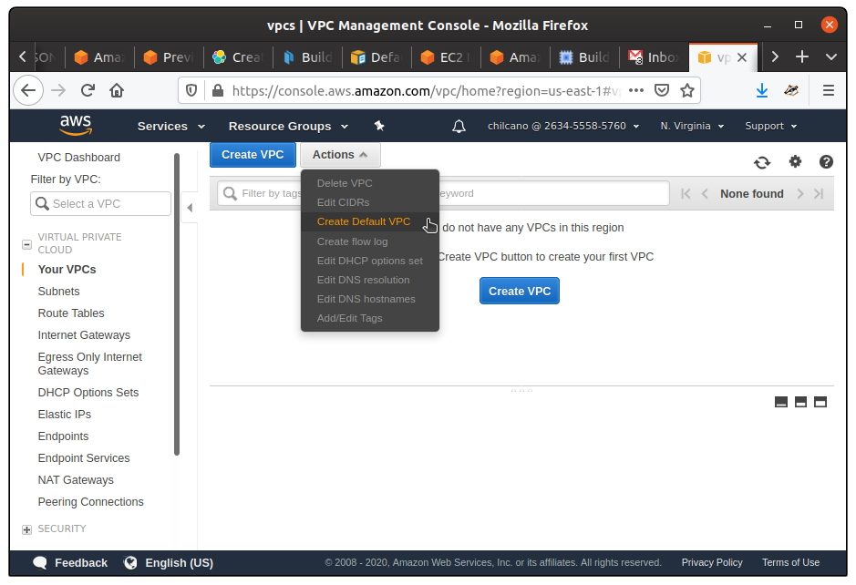
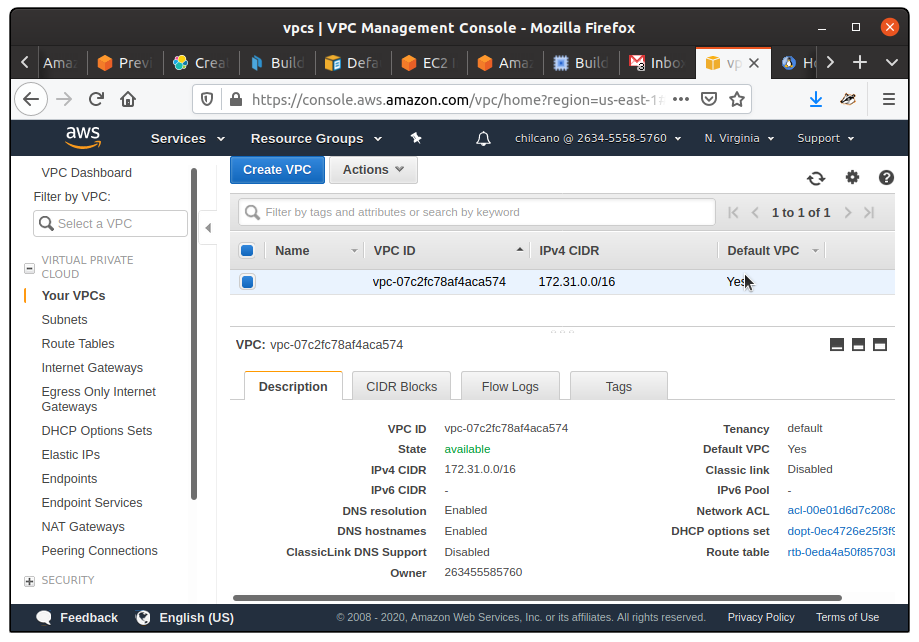
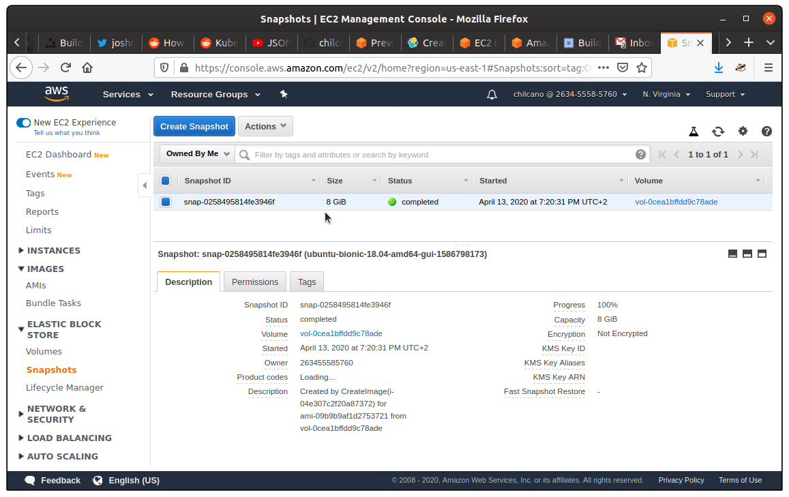
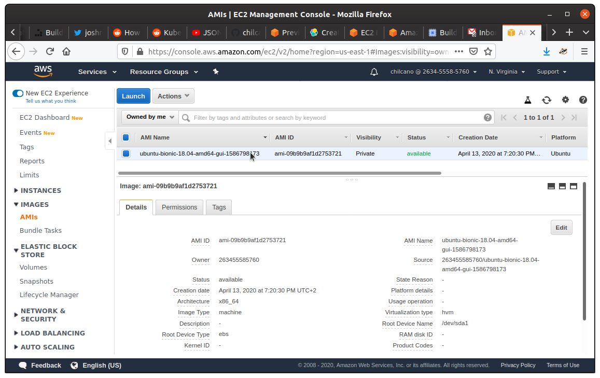

# Creating an Ubuntu-based AMI with minimum GUI based on XFCE4 and X2Go

## Steps

### 1. Install Hashicorp Packer

```sh
$ export LATEST_VER=$(curl -s https://checkpoint-api.hashicorp.com/v1/check/packer | jq -r -M '.current_version')
$ wget https://releases.hashicorp.com/packer/${LATEST_VER}/packer_${LATEST_VER}_linux_amd64.zip
$ unzip packer_${LATEST_VER}_linux_amd64.zip
$ sudo mv packer /usr/local/bin/
$ packer -v
1.5.5
```

### 2. Create a default AWS VPC and Subnet

If you have the `VPCResourceNotSpecified` error, this can happen if you created your AWS account before `2013-12-04`. This is my case and I have to create a `default VPC` through AWS Web Console.

> Further information:
> * [Default VPC and Default Subnets](https://docs.aws.amazon.com/vpc/latest/userguide/default-vpc.html)

### 3. Run Packer 

```sh
$ git clone https://github.com/chilcano/affordable-remote-desktop
$ cd affordable-remote-desktop/resources/packer

$ export AWS_ACCESS_KEY_ID="your-access-key-id"; export AWS_SECRET_ACCESS_KEY="your-secret-access-key"
$ export AWS_VPC_ID="your-vpc-id-07c2fc78af4aca574"; export AWS_SUBNET_ID="your-subnet-id-00096b5a3329dd4b2" 

$ packer validate ubuntu_gui.json

$ packer build ubuntu_gui.json
```

### 4. Check AMI and EC2 Snapshot created







### 5. Delete AMI and EC2 Snapshot

After running the above Packer template, your AWS account now has an AMI associated with it. This AMI is stored in AWS EBS, so unless you want to be charged about ~$0.09/month, you'll probably want to remove it. 
Remove the AMI by first `deregistering` it on the AWS AMIS web console. Next, delete the associated `snapshot` on the AWS Snapshot web console.


## References

1. https://packer.io/intro/getting-started/build-image.html
